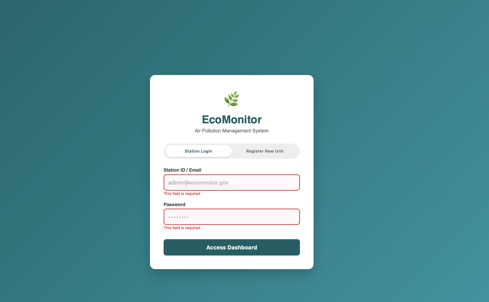
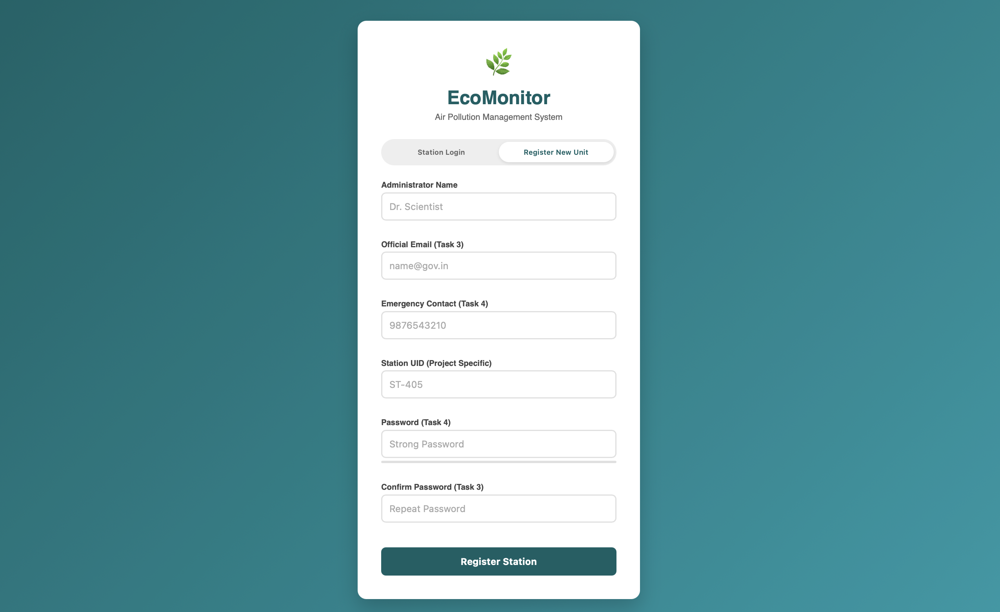
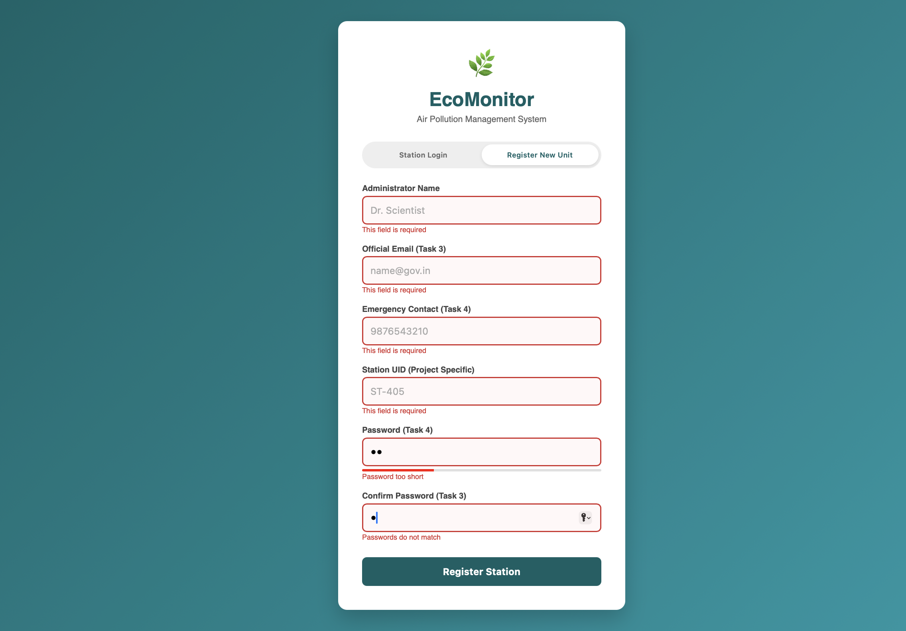

# 🌿 EcoMonitor - Environmental Air Pollution Management System

## 1. Project Overview
**EcoMonitor** is a web-based dashboard designed to monitor, manage, and mitigate air pollution levels. The system provides real-time Air Quality Index (AQI) readings, calculates emission mass loads, and suggests safety protocols based on zonal data (Industrial, Residential, etc.). 

This specific module implements **Secure Access Control** (Experiment 4), featuring a robust Login and Registration system with advanced client-side validation to ensure data integrity for station administrators.

## 2. Key Features
* **Dashboard Analytics:** Real-time display of Sensor UIDs, Live AQI indices, and Calibration status.
* **Dynamic Risk Assessment:** Automatic calculation of emission mass loads with visual risk alerts (Low/High/Critical).
* **Pollutant Inventory:** Searchable list of pollutants (PM2.5, CO, NO2) with interactive hover effects.
* **Secure Authentication Module:**
    * Toggle between Login and Registration views.
    * **Real-time Validation:** Immediate visual feedback (Green Check/Red Error) as the user types.
    * **Password Strength Meter:** Visual bar indicating password complexity.
    * **Security Features:** Copy-paste prevention on sensitive fields.
* **Responsive Design:** Optimized for Desktops, Tablets, and Mobile devices using CSS Flexbox and Grid.

## 3. How to Run
1.  **Download the Source Code:** Ensure you have the following files in the same folder:
    * `index.html` (Main Dashboard)
    * `style.css` (Dashboard Styles)
    * `script.js` (Dashboard Logic)
    * `login.html` (Authentication Page)
    * `login.css` (Authentication Styles)
    * `auth.js` (Validation Logic)
2.  **Launch the System:**
    * Open `login.html` in any modern web browser (Chrome, Edge, Firefox).
3.  **Test the Flow:**
    * **Register:** Click "Register New Unit" and create an account using valid data.
    * **Login:** Use the credentials to log in.
    * **Dashboard:** Upon success, you will be redirected to the main `index.html` dashboard.

## 4. Validation Rules List (Experiment 4)
The registration form enforces the following strict validation rules using JavaScript Regular Expressions (Regex):

| Field | Rule Description | Error Message |
| :--- | :--- | :--- |
| **Station ID / Email** | Must be a valid email format (e.g., `user@domain.com`). | "Invalid email format" |
| **Administrator Name** | Cannot be empty. | "This field is required" |
| **Emergency Contact** | Must be exactly **10 digits**. No letters or special chars. | "Phone must be 10 digits" |
| **Station UID** | Custom format: Starts with 'ST-' followed by 3-4 digits (e.g., `ST-405`). | "Format: ST-XXX" |
| **Password** | Min 8 chars, must include:  • 1 Uppercase (A-Z) • 1 Lowercase (a-z) • 1 Number (0-9) • 1 Special Char (@$!%*?&) | "Password weak" / "Password too short" |
| **Confirm Password** | Must match the 'Password' field exactly. Pasting is disabled. | "Passwords do not match" |

## 5. Screenshots

